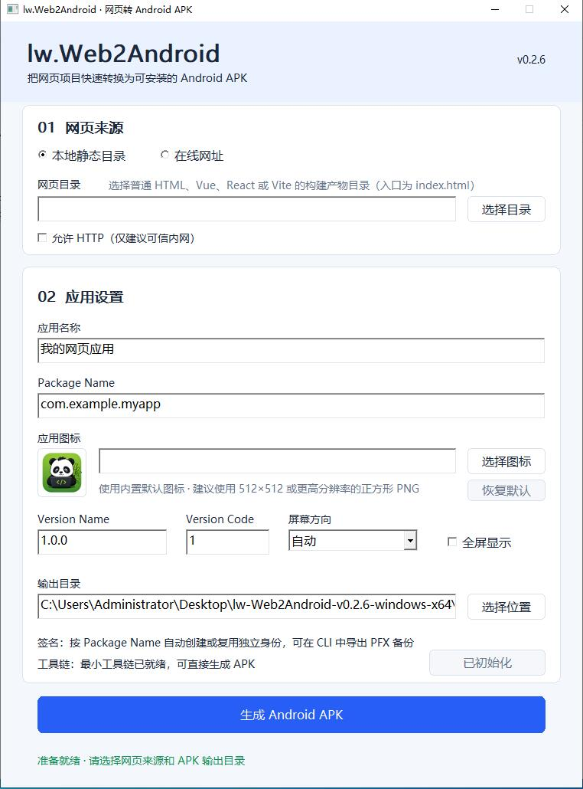

# lw.Web2Android

[English](README_EN.md) | 简体中文

将本地 HTML、Vue、React、Vite 等静态 Web 项目，或一个在线 URL，打包为可安装的 Android APK。

`lw.Web2Android` 面向 Windows 10/11 x64，提供原生 GUI 和 CLI。最终用户不需要安装 Android Studio、Gradle、完整 Android SDK 或完整 JDK；首次使用时确认 Android SDK License，程序会从官方源下载锁定版本的最小组件，并保存在应用程序目录中供后续复用。

## 界面预览

<p align="center">
  
</p>

## 主要能力

- 本地静态网站和在线 URL 两种模式；
- 原生 Windows GUI，支持高 DPI、后台构建和固定尺寸双栏布局；
- 网页来源与应用设置采用左右双栏，左侧内嵌项目支持二维码且不依赖外部图片；
- 预编译 Android Runtime DEX，无需为每个项目重新编译 Java；
- AAPT2 资源生成、ZIP 组装、`zipalign` 和 `apksigner` 完整流水线；
- 每个 Package Name 独立且可复用的 RSA 3072 签名身份；
- Windows DPAPI 加密私钥，以及密码保护的 PFX/P12 备份；
- APK、证书和工具链版本的机器可读发行元数据；
- Packer 与 Android Runtime 轮转日志；
- 标准 `<input type="file">` 系统文件选择器和 Android `DownloadManager`；
- HTML5 视频全屏播放，支持返回键退出与横竖屏切换；
- 对没有移动端 viewport 的固定宽度老式网页启用 Wide Viewport 与 Overview Mode，采用 fit-to-width 整体缩放，不重新排版；
- CLI/project.json 支持正方形 PNG 应用图标，自动生成五档 Android Launcher mipmap 资源；GUI 未指定时使用内置默认图标；
- Custom Scheme 外部应用跳转失败时保留当前 WebView；
- GitHub Actions 自动构建 Runtime、Packer、GUI 和真实 React/Vite Demo。

当前版本：`v0.2.8`<br>
Android：`minSdk 23`，`targetSdk 35`

## 下载与首次使用

从 [GitHub Releases](https://github.com/lxw112190/lw.Web2Android/releases) 下载 Windows x64 ZIP 并完整解压，然后运行：

```text
bin/lw.Web2Android.GUI.exe
```

公开发行包包含：

```text
lw-Web2Android-v0.2.8-windows-x64/
├── bin/
│   ├── lw.Web2Android.GUI.exe
│   └── lw.Web2Android.exe
├── toolchain/
│   ├── jre/
│   ├── runtime/
│   └── runtime-v6.zip
├── assets/default-app-icon.png
├── tools/
├── samples/wechat-article-formatter/
├── docs/
├── SHA256SUMS.txt
├── LICENSE
└── THIRD-PARTY-NOTICES.md
```

公开包不会重新分发 Android SDK 或 Google Build Tools。首次点击 GUI 中的“初始化工具链”，阅读并接受 [Android SDK License](https://developer.android.com/studio/terms) 后，程序会下载并校验锁定版本的命令行工具、Android Platform 和 Build Tools，最终放在当前应用目录：

```text
toolchain/
├── aapt2.exe
├── zipalign.exe
├── android.jar
├── apksigner/
├── jre/
└── runtime/
    └── classes.dex
```

也可以在 PowerShell 中初始化：

```powershell
./tools/install-minimal-toolchain.ps1 -AcceptAndroidSdkLicense
```

下载文件会进行 SHA-256 校验，临时文件会自动清理。初始化完成后不依赖系统的 `ANDROID_SDK_ROOT` 或 `JAVA_HOME`。

## 使用 GUI 生成 APK

1. 选择“本地网页”或“在线网址”。
2. 本地模式选择包含 `index.html` 的构建输出目录，例如 Vite 的 `dist`。
3. 填写应用名称、Package Name、Version Name 和 Version Code。
4. 可选：选择正方形 PNG 应用图标；不选择时使用内置默认图标。
5. 可选：本地项目可在“系统集成”中启用分享文本或文本/配置文件打开方式。
6. 选择屏幕方向、全屏选项和输出目录。
7. 点击“生成 Android APK”；成功后会自动打开输出文件夹并选中生成的 APK。

本地 Web 资源必须使用相对 URL。Vite 项目推荐配置：

```ts
import { defineConfig } from "vite";

export default defineConfig({
  base: "./",
});
```

也可以在 CI 或命令行构建时覆盖：

```bash
npm run build -- --base=./
```

否则 `/assets/...` 会指向 Android 应用域名根目录，而不是 APK 内的 `assets/www/`。

## CLI

示例 `project.json`：

```json
{
  "schemaVersion": 1,
  "mode": "local",
  "name": "My Web App",
  "packageName": "com.example.mywebapp",
  "versionName": "1.0.0",
  "versionCode": 1,
  "source": "dist",
  "entry": "index.html",
  "icon": "branding/icon.png",
  "fullscreen": false,
  "orientation": "auto",
  "allowHttp": false,
  "externalContent": {
    "enabled": true,
    "receiveSharedText": true,
    "openFiles": true,
    "preset": "text-config"
  },
  "output": "output"
}
```

构建和签名身份管理：

```powershell
./bin/lw.Web2Android.exe validate project.json
./bin/lw.Web2Android.exe build project.json
./bin/lw.Web2Android.exe signing info com.example.mywebapp
./bin/lw.Web2Android.exe signing export com.example.mywebapp D:\backup\mywebapp.pfx
```

路径相对于 `project.json` 解析。`entry` 相对于 `source`；打包后会自动转换为 APK 内的 `assets/www/<entry>`。远程模式使用 `mode: "remote"` 和 `url`，HTTP 只有在 `allowHttp: true` 时允许。

完整 CLI 参数见 [packer/README.md](packer/README.md)。

## 使用其他 App 打开文本 / 配置文件

该能力仅支持本地 Web 项目。GUI 勾选“接收分享文本”或“打开文本 / 配置文件”，选择“常用文本文档”“文本与配置文件（推荐）”或“代码、文本与配置文件”预设后构建并安装 APK；随后可从微信、QQ 或文件管理器中分享文本，或选择“用其他应用打开”。在线网址模式会清空并禁用这些控件。

Web 页面通过固定事件 `lw:external-content` 接收一个只读文本副本。冷启动时业务脚本可能晚于 Runtime，需先消费固定队列：

```js
function handleExternalContent(payload) {
  console.log(payload.kind, payload.name, payload.mimeType, payload.text);
}

const queue = window.__lwExternalContentQueue || [];
while (queue.length) handleExternalContent(queue.shift());
window.addEventListener("lw:external-content", event => {
  handleExternalContent(event.detail);
});
```

Payload schema 1 包含 `kind`（`text`/`file`）、`sourceAction`（`share`/`view`）、`name`、`extension`、`mimeType`、`size`、`encoding` 和 `text`。默认最大文本为 8 MiB，支持严格 UTF-8、UTF-8 BOM、UTF-16LE/BE BOM；多文件、二进制、未允许类型及其他编码会被拒绝并显示轻量提示。示例见 [samples/external-content-editor](samples/external-content-editor)。

> 该能力只把用户明确选择或分享的内容单向交给本地 Web 页面，不提供通用 Native Bridge，不会自动获得整个手机文件系统权限，也不会写回原始 `content://` URI。Runtime 日志不记录正文、完整 URI 或文件名。

## 企业内网与 HTTP

GUI 提供“允许 HTTP（仅建议可信内网）”选项。在线网址以 `http://` 开头时会自动勾选；本地 Vue/React 项目请求 HTTP API 时需要手动勾选。该选项会为 APK 启用明文流量 [Network Security Config](https://developer.android.com/privacy-and-security/security-config) 和 [WebView mixed-content](https://developer.android.com/reference/android/webkit/WebSettings) 允许模式。HTTP 流量可被同网络中的人监听或篡改，生产环境优先使用 HTTPS。

前端已部署在内网服务器时，选择“在线网址”，填入实际地址：

```text
http://intranet.example.test:9000/
```

`intranet.example.test` 仅为文档示例，请替换为手机通过公司 Wi-Fi、专网或 VPN 能访问的内网主机。同时确认服务器监听可访问网卡，防火墙已放行对应端口。

本地 Vue `dist` 打入 APK、Spring Boot 在内网服务器时：

1. 构建 Vue 前设置 API Base URL，例如 `http://api.intranet.example.test:9001`；
2. GUI 选择“本地静态目录”并勾选“允许 HTTP”；
3. Spring Boot CORS 允许 Origin `https://appassets.androidplatform.net`；
4. 使用 Cookie/Session 时显式允许该 Origin 和 credentials，不要使用通配符 `*`。

`WebViewAssetLoader` 使本地页面保持标准 Web Origin/CORS 行为，lw.Web2Android 不使用 Native Bridge 绕过同源策略。如果能把前端和 API 部署在同一个 HTTPS Origin，优先采用同源方案。

## 输出、签名与日志

每次成功构建会生成：

```text
<应用名>-<版本>-android.apk
<APK>.sha256
<APK名称>.release.json
<APK名称>-RELEASE.md
```

同一个 Package Name 会复用同一个证书，使新 APK 能覆盖安装旧版本。默认签名身份保存在：

```text
%LOCALAPPDATA%\lw.Web2Android\keys\<Package Name>\
```

请导出并离线保存 PFX/P12 备份。签名身份丢失后，无法再发布可覆盖安装的更新。

Packer 日志：

```text
<发布包目录>\logs\packer.log
```

工具链初始化日志：

```text
<发布包目录>\logs\toolchain-init.log
```

Android Runtime 日志：

```text
/sdcard/Android/data/<Package Name>/files/logs/runtime.log
/sdcard/Android/data/<Package Name>/files/logs/device-info.log
```

网页通过标准 `<input type="file">` 选择文件时，Runtime 会调用 Android 系统文件选择器，只把用户明确选择的 `content://` URI 返回给 WebView，不开启文件系统访问。HTTP/HTTPS 下载由系统 `DownloadManager` 在后台执行，保存到：

```text
/sdcard/Android/data/<Package Name>/files/Download/
```

下载会沿用当前 WebView 会话所需的 Cookie 和 User-Agent，但这些内容不会写入日志。`blob:`、`data:` 和 `file:` 下载不通过 Native Bridge 或 JavaScript 注入实现，Runtime 会记录 WARN 并显示轻量提示。

Packer 和工具链初始化器会在发布包当前目录自动创建 `logs` 文件夹。初始化日志记录下载地址、SHA-256 校验、JRE 选择、`sdkmanager` 输出、工具链组装、临时目录清理和完整失败原因。所有日志文件均按单文件 2 MiB 轮转，最多保留 5 个归档。Packer 日志使用带 BOM 的 UTF-8，确保中文应用名可由 Windows 日志查看器正确识别。

`runtime.log` 使用手机本地时间并带 UTC 偏移，例如 `2026-08-18 17:16:49.955 +08:00`，记录 Activity 生命周期、页面加载、HTTP/SSL、WebView renderer、WebResourceError、JavaScript Console 和未捕获异常。`device-info.log` 每次启动同时记录本地时间、UTC、时区，以及应用、设备、WebView Provider、网络传输类型、Allow HTTP、Mixed Content 模式和 Runtime 配置摘要。日志会对常见 Password、Token、Authorization、Cookie 内容脱敏，也不采集 IMEI、Android ID、MAC、SSID或手机本机 IP；启动 URL 会移除 query 和 fragment。发行元数据中的构建时间继续使用 UTC。

Runtime 还会记录最终生效的 WebView 视口策略、屏幕像素/密度，以及页面完成后的实际 Web viewport 指标（inner/scroll 尺寸与 DPR），帮助区分固定宽度页面的 fit-to-width 缩放和响应式重排。

## 真实 Web Demo 与 CI

统一的 `lw.Web2Android CI` 会：

1. 编译并检查 Android Runtime；
2. 组装锁定版本的最小工具链；
3. 编译和测试 C++ Packer/GUI；
4. 检出 [wechat-article-formatter](https://github.com/lxw112190/wechat-article-formatter) 的固定提交；
5. 执行 `npm ci` 和 `npm run build -- --base=./`；
6. 将真实 React/Vite `dist` 打包为签名 APK；
7. 构建中文目录/文件名样例，并验证所有 Web Assets 都是 UTF-8、正斜杠且无重复的 APK 条目；
8. 验证 APK 对齐、签名、内部资源、Runtime 入口、发行元数据和签名身份复用；
9. 上传一个统一的 Windows x64 Artifact。

该 Demo 已在 Android 真机验证通过。固定源码提交记录在 [.github/workflows/ci.yml](.github/workflows/ci.yml)，发行包中的 `samples/wechat-article-formatter/SOURCE.md` 记录来源、版本和构建命令。

推送 `v*` 标签时，完整 CI 成功后会自动创建 GitHub Release：

```bash
git tag -a v0.2.8 -m "lw.Web2Android v0.2.8"
git push origin v0.2.8
```

## 架构

```text
Manifest + res/ ── AAPT2 ── resources.apk ─┐
                                           │
assets/lw-config.json ─────────────────────┤
assets/www/**/* (local only, UTF-8) ───────┼─ ApkAssembler ─ zipalign ─ apksigner ─ Signed APK
Precompiled classes*.dex ──────────────────┘
```

AAPT2 只处理 Android Manifest、`res/`、`android.jar` 和资源表，不再通过 `-A` 接触 Web 项目。ApkAssembler 使用 Windows Unicode 路径读取网页文件，并以 UTF-8、正斜杠的规范 ZIP Entry 原样注入 APK，因此中文、日文、空格及其他 Unicode 文件名不会交给 Android Resource 工具解释。

Android Runtime 使用 `WebViewAssetLoader` 通过 HTTPS 风格的应用内 URL 加载本地资源，不使用 `file://`，也不提供 `addJavascriptInterface` Native Bridge。

## 从源码构建

只修改 C++ Packer/GUI 时，安装 Visual Studio 2022 的“使用 C++ 的桌面开发”即可。根目录的 [lw.Web2Android.sln](lw.Web2Android.sln) 是原生 VS2022 多工程解决方案，选择 `Release | x64` 后可直接生成，不调用 PowerShell、CMake 或 Ninja。完整私有开发包已包含解压好的离线 spdlog 头文件。详细步骤见 [DEVELOPMENT.md](DEVELOPMENT.md)。

CMake 构建继续保留给 CI 和命令行开发者：

```powershell
cmake --preset vs2022-x64
cmake --build --preset vs2022-release
ctest --preset vs2022-release-tests
```

重新编译 Android Java Runtime 才需要 JDK 17、Gradle 8.9 和锁定版本的 Android SDK。普通用户不需要这些开发依赖。

```powershell
gradle -p runtime clean :app:lintRelease :app:assembleRelease
./tools/package-runtime.ps1
```

仓库不提交预编译 Runtime 或 APK；这些文件由 CI 从源码生成。主要目录：

```text
packer/       C++17 Packer、Win32 GUI 与测试
runtime/      Android Java Runtime
samples/      Remote 与 Unicode Assets 回归配置
tools/        Runtime、工具链与发行打包脚本
.github/      统一 CI 与 Release 流程
```

`tools/package-vs2022-development.ps1` 可在本机生成包含源码、离线依赖、预编译程序、Runtime v6 和完整最小工具链的私有 VS2022 开发包。Android SDK 组件受其许可约束，该完整包不要上传为公开 Release。

## 当前限制

- 仅支持 Windows 10/11 x64 主机；
- 当前输出 APK，不输出 AAB；
- 自定义 Launcher Icon 当前只接受 192×192 至 4096×4096 的正方形 PNG，不提供 Adaptive Icon 前景/背景编辑；
- 下载仅支持 HTTP/HTTPS；`blob:`/`data:` 下载暂不支持；
- 不提供 Native Bridge。

## License

[MIT License](LICENSE)，作者：天天代码码天天。

第三方组件及许可见 [THIRD-PARTY-NOTICES.md](THIRD-PARTY-NOTICES.md)。Android SDK 与 Google Build Tools 受其各自许可约束，不属于本项目 MIT License 的授权范围。

## 联系与支持

- 作者：天天代码码天天
- QQ：819069052
- QQ Group：C# 人工智能实践（群号：758616458）

如果项目对你有帮助，可以扫码支持维护：

<p align="center">
  
</p>
